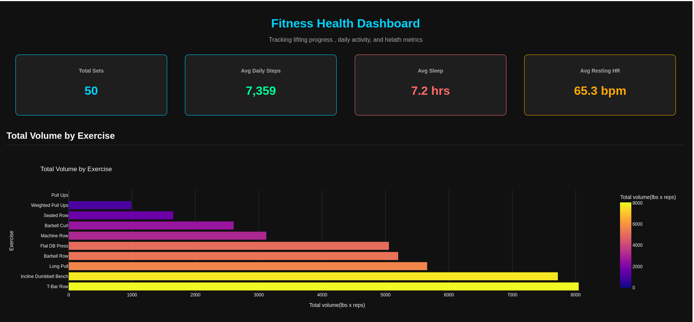
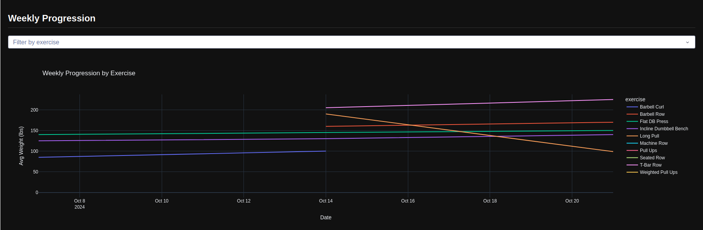
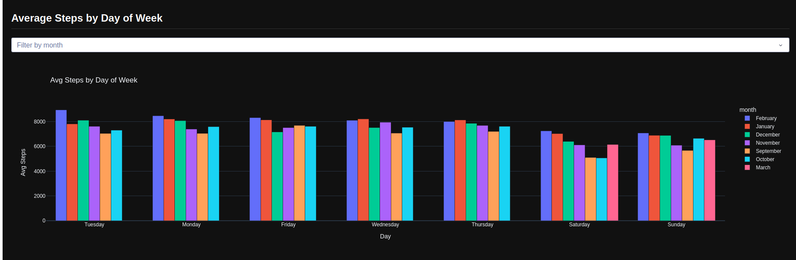
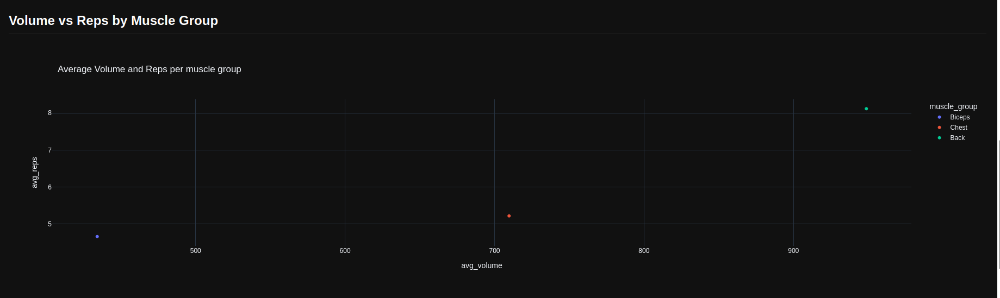
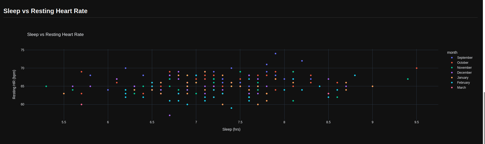
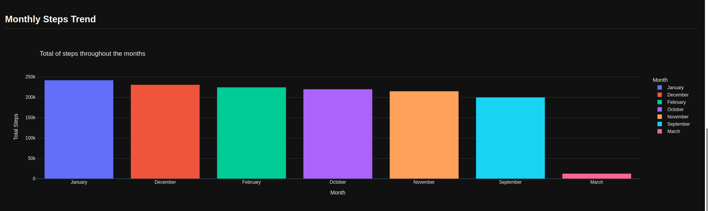
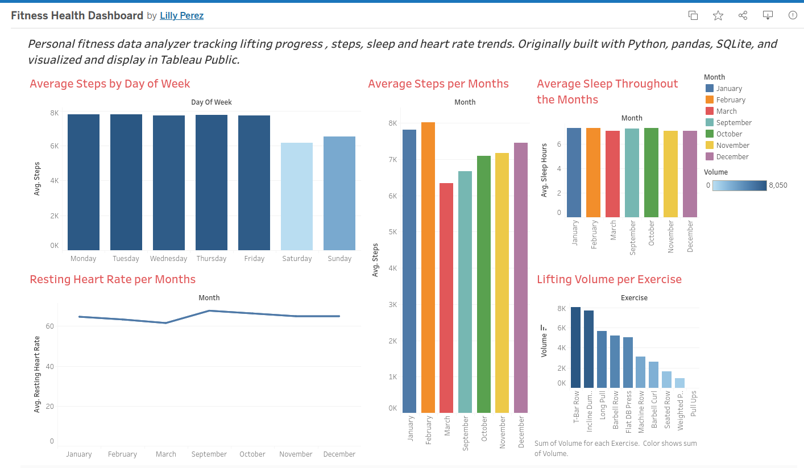

# Fitness-Health-Dashboard
A personal fitness data analyzer that is built with Python and Dash that tracks lifting progress, daily activity, sleep, and resting heart rate throughout the months in an  interactive dashbaord.

## What was used to create this: 
**Python** to have the data processing and have the dashboard logic 
**Pandas** used to clean and analysis data 
**SQLite** usted to storage and structure data 
**SQL** use to qggregate and query fitness metrics 
**Plotly & Dash** Data visualization 
**Render** Used to deploy 

## Features 
**Cards** key health metric summarize 
**Dropdown Filter** with the choices of exercise and month selection.
**Lifting progression charts** 
**Sleep vs heart rate anaylsis**
**Monthly and Daily steps**

## Instructions how to run it locally 

1.Clone the reposioty 
--- git clone github link
--- cd fitness-health-dashboard

2. Install dependencies 
pip install -r requirements.txt

3. Create the database 
make sure you are in your scripts folder , then do:
python3 database.py

4. Run the app 
python3 app.py 

**Should say in terminal -- Dash is running on http://127.0.0.1:8050/ **Open Browser**

# Project Structure

CSV DATA (clean data in a csv file ready to use in folder data) 

---> PANDAS CLEANING (in script folder , file clean_and_explore_data.py - data is further cleaned out , ask and answer question for further analyzaion )

----> SQLITE DATABASE(grabs both csv files and store it in a single file name fitness.db locally, easier to query and anaylsis if the datasets grew) 

----> SQL QUERIES - queries that caluclated total volume per exercie , weekly progression, health metrics vy day of week, muscle group performanece 

-----> PLOTLY CHARTS - in file charts.py -creating a bar, line, scatter charts 

----> DASH DASHBOARD- visulaztion dashboard all structures in file app.py. 

## Live DEMOS
**Dash Dashboard** https://fitness-health-dashboard.onrender.com/

**Tableau Dashboard** https://public.tableau.com/app/profile/lilly.perez2284/viz/FitnessHealthDashboard/Dashboard1#1

